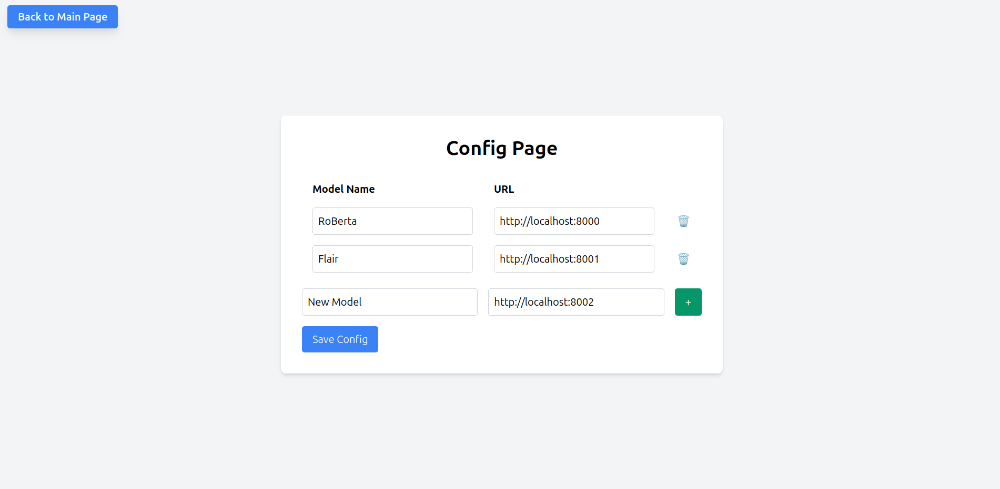

# ner_visualizer

This is a quick and dirty app for visualizing the results of Named Entity Recognition (NER).
You can use it with in conjunction with: https://github.com/taranis-ai/natural-language-processing
or your own NER models.

The NER Visualizer expects the NER model endpoint to accept data as a JSON in the form

```javascript
{ "text": "This is some text" }
```

and return the named entities in the form

```javascript
{ "entity": "TYPE" }
```

For example:

```javascript
// Data sent to model:
{ "text": "This is an example for NER, about the ACME Corporation which is producing Dynamite in Acme City, which is in Australia and run by Mr. Wile E. Coyote." }

// NER result returned from model
{'Australia': 'LOC', 'Wile E. Coyote': 'PER'}
```


## Pre-requisites

### Install uv

With curl:

    curl -LsSf https://astral.sh/uv/install.sh | sh

### Set up virtual environment

    uv venv
    source .venv/bin/activate
    uv sync


## Run App

To run locally, execute

    flask run


## Usage

First, click on the config button in the upper left corner. Here, you can define the name of the buttons and the URLs of the NER models you want to test.



You can change the name of the default models or add new models.
If you click on "Save Config" and then "Back to Main Page", you will see the corresponding buttons.


You can now enter some text and let the models do the NER by clicking on the corresponding button.


